# CHIP8-EMU

Configurable CHIP-8 emulator, debugger and disassembler.

[Try it in your browser](https://berecik.itch.io/chip8-emu)!


# Table of Contents

1. [Overview](#overview)
2. [Compiling to Desktop](#compiling-to-desktop)
    1. [Prerequisites](#prerequisites)
    2. [Linux](#linux)
    3. [Windows](#windows)
    4. [Mac](#mac)
3. [Compiling to WebAssembly](#compiling-to-webassembly)
    1. [Prerequisites](#prerequisites-1)
    2. [Compilation](#compilation)
4. [Emulator Instructions](#emulator-instructions)
    1. [Launching](#launching-the-emulator)
    2. [Configuration](#emulator-configuration)
    3. [Loading ROMs](#loading-roms)
    4. [Interface](#emulator-interface)
5. [Disassembler Instructions](#disassembler-instructions)
    1. [Usage](#disassembler-usage)
    2. [Configuration](#disassembler-configuration)
6. [Code Overview](#code-overview)
    1. [Introduction](#introduction)
    2. [Architecture](#architecture)
    3. [Emulator Core](#emulator-core)
    4. [Emulator Frontend](#emulator-frontend)
    5. [Debugger](#debugger)
    6. [Disassembler](#disassembler)
    7. [Dependencies](#dependencies)
    8. [Tests](#tests)
    9. [CI](#ci)
7. [Sources](#sources)


# Overview

This is an emulator, debugger and disassembler toolchain for the retro virtual machine [CHIP-8](https://en.wikipedia.org/wiki/CHIP-8) and its variants.

It aims to most authentically replicate the inner workings of the original virtual game console and allow you to study what's under the hood of both the machine and the games.

### Features

- **Full emulation of the original CHIP-8 and many of its variants** 
- **Built-in debugger**, which allows you to look at the inner workings of the console, but also control the flow and execute the games instruction by instruction
- **Disassembler**, both built into the debugger, but also available as a separate command line tool
- **Several included configs** - COSMAC, CHIP-48, SCHIP 1.0, SCHIP 1.1, SCHIP-MODERN  
- **Configurable emulator properties** like foreground and background colors, keymap and more

<details>
<summary>Screenshots (click to expand)</summary>

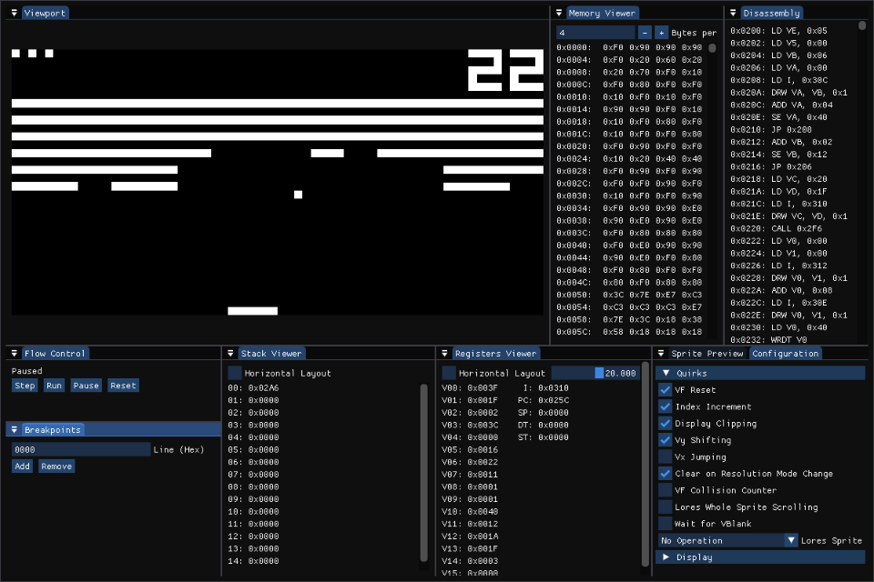
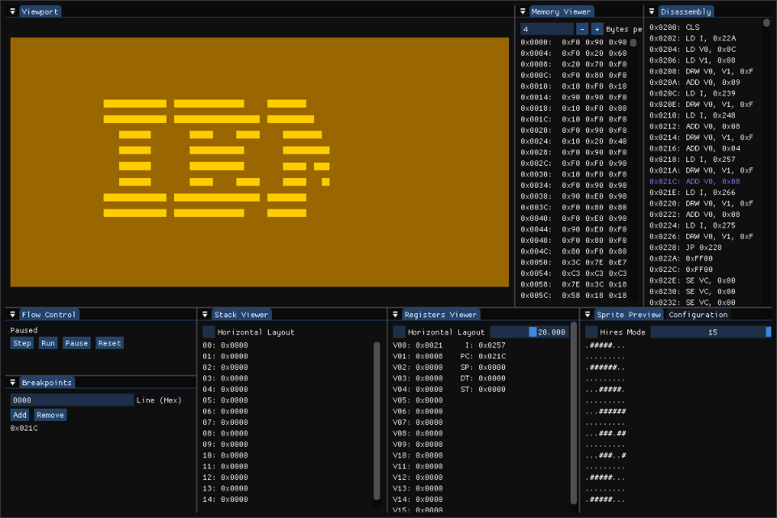
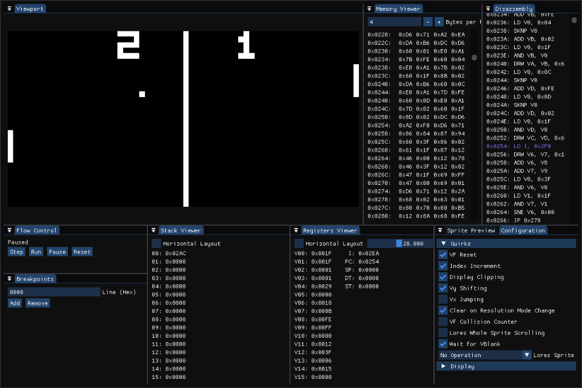

</details>

### Motivation

This project is something I've wanted to do for a while. It started out as me wanting to delve a little deeper into computer architecture and organisation - I personally find it best to learn hands-on, so implementing an actual processor in code was something I was really excited about. 

However, due to the relative simplicity of the CHIP-8, I slowly transformed this project into a broader software engineering exercise, allowing me to play with tools I otherwise had no opportunity to use. Things like Valgrind, GitHub Actions, WebAssembly and many more, which I discuss in more detail in the later parts of this README. 

I learned a lot and had a lot of fun developing this project, and I hope you too have fun playing some old games and looking at how they were made!


# Compiling to Desktop

## Prerequisites

Compiling and running the program for the desktop requires you to have the `SDL2` library installed on your system. Other used libraries are linked statically, so you don't need to install them yourself. Installing `SDL2` is explained in the section depending on your OS.

## Linux

Installing `SDL2` on Linux is very simple, you can just run the following command in your terminal:

```bash
sudo apt install libsdl2-dev
```

The above assumes Debian-based distributions. If you use a different package manager, adjust the command accordingly.

After you have the dependencies installed, you can compile the program using CMake:

```bash
cmake -S . -B build
cmake --build build
```

## Windows

On Windows there are multiple methods of obtaining `SDL2`. I recommend using `vcpkg`. To download `vcpkg` refer to the instructions at [their official webpage](https://vcpkg.io/en/).

Then you can run the following command in the terminal:

```console
vcpkg install sdl2:x64-windows
```

After you have the dependencies installed, you can compile the program using CMake. When using `vcpkg` this requires you to pass the toolchain file. The command (performed at the root of the repository) should look like this:

```console
cmake -S . -B build -DCMAKE_TOOLCHAIN_FILE="<path_to_vcpkg>/scripts/buildsystems/vcpkg.cmake"
cmake --build build
```

## Mac

To install on MacOS you need to use `brew`. To download `brew` follow the instructions at [their official webpage](https://brew.sh).

Then you can just run the following command in the terminal:

```zsh
brew install sdl2
```

After you have the dependencies installed, you can compile the program using CMake. This may look different depending on your Mac version. Move to the root of the repository and perform one of the following commands.

If `brew` installs programs to `/usr/local/` (which it does on older Macs) you can just type:

```zsh
cmake -S . -B build
cmake --build build
```

On modern Macs `brew` installs to `/opt/homebrew` - if that's your case, you must type:

```zsh
cmake -S . -B build -DCMAKE_PREFIX_PATH="/opt/homebrew"
cmake --build build
```


# Compiling to WebAssembly

## Prerequisites

When compiling to WebAssembly you do not need to worry about dependencies. They are either linked statically or handled by `emscripten`, which is what we'll be using to compile to WASM.

In order to download `emscripten` head over to [their official webpage](https://emscripten.org) and refer to the instructions. The instructions will assume `emscripten` is added to `PATH`, so adjust the commands accordingly to your selected way of installation.

The `emscripten` version used is `6.0.9`.

## Compilation

In order to compile to WebAssembly you must run the following commands:

```bash
emcmake cmake -S . -B build-wasm
cmake --build build-wasm
```

After the compilation is done you can see its output by entering the following command:

```bash
emrun build-wasm/src/chip8/platform/wasm/index.html 
```


# Emulator Instructions

The emulator is available as a desktop application and in the browser. 

If you wish to use the emulator in the browser, it is available [here](https://berecik.itch.io/chip8-emu). Then only the [Loading ROMs](#loading-roms) and [Emulator Interface](#emulator-interface) sections apply to you.

Otherwise, you must use the command line to launch and configure the program. This gives you more options of configuration compared to just using the browser version, as not all options present in config files are available through the graphical interface.

## Launching the Emulator

In order to launch the emulator you must use the following command (this assumes the `chip8-disasm` executable is in your current directory):

```bash
chip8 rom_path [--config PATH]
```

Where the required argument is:

- `rom_path` - Path to the ROM file.

And the optional argument is:

- `-c PATH`, `--config PATH` - Specifies path to the config file (`./configs/emulator/example.toml` by default on desktop, the COSMAC config at `./configs/emulator/cosmac.toml` is used in the WebAssembly build).

## Emulator Configuration

Configuration files can be passed to the CLI application as arguments. A set of config files for different variants is provided with the software. This includes configuration files for: COSMAC VIP, CHIP-48, SCHIP 1.0, SCHIP 1.1, SCHIP-MODERN. You can also modify them or create your own.

Here is an example config file:

```toml
[application]
loop_frequency = 600
timer_frequency = 60
display_frequency = 60
audio_frequency = 440
window_width = 800
window_height = 600
foreground_color = 0xFFFFFF
background_color = 0x000000

[memory]
reserved_end = 0x200
program_end = 0x1000
reserved_read_only = true

[display]
width = 64
height = 32
default_mode = "hires"

[quirks]
vf_reset = false
index_increment = false
display_clipping = false
vy_shifting = false
vx_jumping = false
clear_on_mode_change = true
vf_collision_counter = false
lores_whole_pixel_scrolling = false
wait_for_vblank = false
lores_sprite_handling = "draw_wide"

[keymap]
0 = "X"
1 = "1"
2 = "2"
3 = "3"
4 = "Q"
5 = "W"
6 = "E"
7 = "A"
8 = "S"
9 = "D"
A = "Z"
B = "C"
C = "4"
D = "R"
E = "F"
F = "V"
```

Any options not specified within a configuration file have chosen default options.

### Application Options

- `loop_frequency` - The processor's frequency [Hz] or how many times the processor is updated per second. `600` by default.

- `timer_frequency` - The timers' frequency [Hz] or how many times the timers are updated per second. `60` by default.

- `display_frequency` - The display's refresh rate [Hz]. `60` by default.

- `audio_frequency` - The frequency of the audio signal [Hz]. `440` by default, which is the A note.

- `window_width` - Width of the program's window (not the CHIP-8 display, but the entire emulator's window) in pixels. `1200` by default.

- `window_height` - Height of the program's window (not the CHIP-8 display, but the entire emulator's window) in pixels. `800` by default.

- `foreground_color` - Color of enabled pixels written in hex. For example `0xFF0000` is red and `0x00FF00` is green. `0xFFFFFF` (white) by default.

- `background_color` - Color of disabled pixels written in hex. For example `0xFF0000` is red and `0x00FF00` is green. `0x0` (black) by default.

### Memory Options

- `reserved_end` - How big reserved memory is, in bytes. May also be interpreted as where the program segment starts. `0x200` means bytes `0x00` to `0x200` (exclusive) are reserved. `0x200` by default.

- `program_end` - The byte at which the program segment ends. May also be interpreted as where the entire memory ends. This value is exclusive - `0x1000` means the last accessible byte is `0xFFF`. `0x1000` by default.

- `reserved_read_only` - Defines whether reserved memory can be written to during the emulator's runtime. `true` by default.

### Display Options

- `width` - Width of the CHIP-8 display. `64` by default.

- `height` - Height of the CHIP-8 display. `32` by default.

- `default_mode` - The resolution mode the emulator starts with. May be either `hires` or `lores`. `lores` mode means each pixel is doubled in size - a backwards compatibility option of the SCHIP and a few other variants. This means that configs for the original COSMAC CHIP-8 should use `hires` mode (despite not supporting it) and configs for variants which have resolution modes should use `lores` (as that is the default in most of these variants). `hires` by default.

### Quirks

- `vf_reset` - Whether logical operations (`AND`, `OR`, `XOR`) reset register VF. `false` by default.

- `index_increment` - Whether instructions `0xFx55` and `0xFx65` (reading or writing registers to memory) increment register I. `false` by default.

- `display_clipping` - Whether sprites are clipped or wrapped around. `false` by default.

- `vy_shifting` - Whether shift operations use Vy. `false` by default.

- `vx_jumping` - Whether jump operations use Vx. `false` by default.

- `clear_on_mode_change` - Whether changing the resolution mode clears the display. `true` by default.

- `vf_collision_counter` - Does the VF register act as a counter or as a flag when drawing. `false` by default.

- `lores_whole_pixel_scrolling` - Whether scrolling in lores mode scrolls by whole pixels or by half pixels. `false` by default.

- `wait_for_vblank` - Whether the processor should wait until next frame is drawn. `false` by default.

- `lores_sprite_handling` - How hires sprites are handled in lores mode: `draw_wide` - 16x16, `draw_tall` - 8x16, or `no_operation`. `draw_wide` by default.

### Keymap

This is a map of keys of the CHIP-8 keyboard (left side) to your actual keyboard (right side).

CHIP-8 keyboard layout was different from the keyboards we use today. It looked like this:

<table>
<tbody>
    <tr>
        <td>1</td><td>2</td><td>3</td><td>C</td>
    </tr>
    <tr>
        <td>4</td><td>5</td><td>6</td><td>D</td>
    </tr>
    <tr>
        <td>7</td><td>8</td><td>9</td><td>E</td>
    </tr>
    <tr>
        <td>A</td><td>0</td><td>B</td><td>F</td>
    </tr>
</tbody>
</table>

The most common mapping of this layout to today's keyboards (and the one used in the example config) looks like this:

<table>
<tbody>
    <tr>
        <td>1</td><td>2</td><td>3</td><td>4</td>
    </tr>
    <tr>
        <td>Q</td><td>W</td><td>E</td><td>R</td>
    </tr>
    <tr>
        <td>A</td><td>S</td><td>D</td><td>F</td>
    </tr>
    <tr>
        <td>Z</td><td>X</td><td>C</td><td>V</td>
    </tr>
</tbody>
</table>

The keymap **must** be defined in all configs. It is the one thing that does not have default values.

## Loading ROMs

Only the desktop version supports loading ROMs as command line arguments.

However both versions support loading ROMs by drag-and-drop. Simply drop the ROM you wish to load onto the emulator's window.

ROMs begin in a paused state. In order to actually play a ROM you must press the Run button in the `Flow Control` widget.

## Emulator Interface

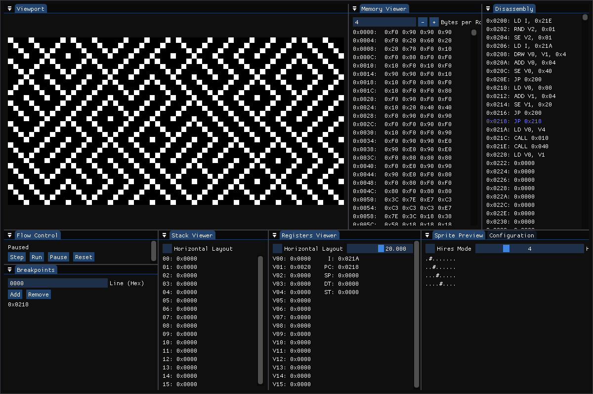

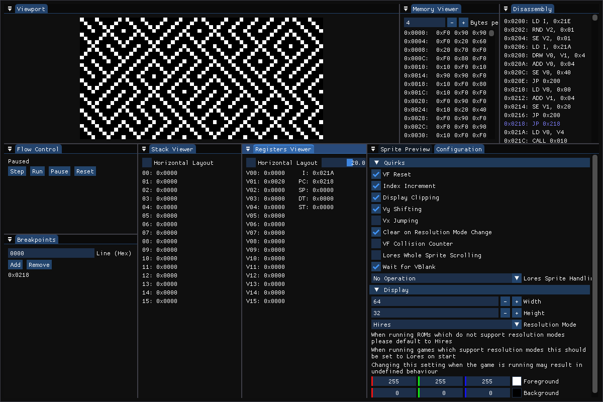

The interface is comprised of many widgets. They are resizable and dockable - you can move them around as you wish. This section will go over the widgets one by one.

- `Viewport` - Displays the contents of the CHIP-8 display.

- `Memory Viewer` - Visible on the right, displays the contents of the CHIP-8's RAM. The amount of bytes per row can be configured.

- `Disassembly` - Visible on the right of `Memory Viewer`. Displays the disassembled contents of the program segment of CHIP-8's RAM. The current instruction is highlighted in blue.

- `Flow Control` - Visible on the left, just below the `Viewport`. Displays the emulator's current state (running or paused). Provides the player control over the running program's flow.

    - `Step` - Step over one instruction.

    - `Run` - Continue running normally until it hits a breakpoint.

    - `Pause` - Pauses the emulator.

    - `Reset` - Reset the currently loaded ROM, allowing you to start over. Starts in paused mode.

- `Breakpoints` - Visible just below `Flow Control`. Allow you to add and remove breakpoints. You must input the line at which you want to place or remove a breakpoint and press `Add` or `Remove` accordingly. Currently placed breakpoints appear just under the buttons.

- `Stack Viewer` - Visible to the right of `Flow Control` and `Breakpoints`. Displays the current state of the processor's stack. Can be configured to list it vertically or horizontally. When displayed horizontally, the distance between elements may also be configured.

- `Registers Viewer` - Visible to the right of `Stack Viewer`. Displays all the processor's registers - all V registers on the left, and the rest on the right. Can be configured to list it vertically or horizontally. The horizontal distance between elements may also be configured.

- `Sprite Preview` - Visible on the right of `Registers Viewer` on the first screenshot. Previews the sprite present at the I register. You can configure whether the sprite is shown as if it was a `hires` sprite or not. The sprite's height must also be manually configured, as there's no way to know how much of the sprite will be drawn until a `DRW` instruction.

- `Configuration` - Docked in the same place as `Sprite Preview`, visible on the second screenshot. Allows you to configure the emulator during its runtime. If you want to know what the options do, refer to the [Emulator Configuration](#emulator-configuration).


# Disassembler Instructions

In addition to being bundled with the emulator/debugger, the disassembler is also available as a separate command line tool.

It is also worth mentioning that the debugger's built-in disassembler does not require its own config - the emulator's config is used to create a disassembler config which matches its options.

## Disassembler Usage

The usage is as below (this assumes the `chip8-disasm` executable is in your current directory):

```bash
chip8-disasm rom_path [--config PATH] [--prettify]
```

Where the required argument is:

- `rom_path` - Path to the ROM file.

And optional arguments are:

- `-c PATH`, `--config PATH` - Specifies path to the config file (`./configs/disassembler/example.toml` by default).

- `-p`, `--prettify` - Flag which makes the output appear as a table with line numbers, hex instructions and disassembled code.

    Example output without prettify flag:

    ```
    CLS
    LD V0, 0x01
    LDF V0
    JP 0x206
    ```

    Example output with prettify flag:

    ```
    LINE    HEX     INSTRUCTION              
    ------------------------------------
    0x0200  0x00E0  CLS                      
    0x0202  0x6001  LD V0, 0x01              
    0x0204  0xF029  LDF V0                   
    0x0206  0x1206  JP 0x206           
    ```

## Disassembler Configuration

Configuration files can be passed to the CLI application as arguments. Here is an example config file:

```toml
[disassembler]
program_start = 0x200
vy_shifting = false
vx_jumping = false
hires_operations = false
```

### Options

- `program_start` - Used only in `pretty` mode. Defines what line the first line of the program is.

- `vy_shifting` - Whether the Vy Shifting quirk is on. This defines whether shifting operations are interpreted as having one or two arguments like: 

    `0x8xy4` -> `SHR Vx, Vy` when true, `SHR Vx` when false.

    `0x8xyE` -> `SHL Vx, Vy` when true, `SHL Vx` when false.

- `vx_jumping` - Whether the relative jump operation is interpreted as `0xBxnn` or as `Bnnn`. For example the outputs may be:

    `JP V1, 0x23` when true, as only two digits are left for the second argument, and the first argument can be any register.

    `JP V0, 0x123` when false, as three digits make up the second argument and the first is always register V0.

- `hires_operations` - Whether any operations to do with resolution modes should appear. This includes:

    `0x00FB` -> `SCR` when true, treated as data when false

    `0x00FC` -> `SCL` when true, treated as data when false

    `0x00FE` -> `LOW` when true, treated as data when false

    `0x00FF` -> `HIGH` when true, treated as data when false

    `0x00Fx` -> `SCD x` when true, treated as data when false

    `0xDxy0` -> `DRWH Vx, Vy` when true, `DRW x, y, 0` when false

    `0xFx30` -> `LDFH Vx` when true, treated as data when false


# Code Overview

## Introduction

This project required me to implement the CHIP-8 virtual machine, its peripherals, and a debugger around it. This means that I had to implement its 8-bit processor, segmented memory, monochrome display, 16-key keyboard, and also persistent storage for modern variants.

The processor is comprised of 16 general purpose 8-bit registers (named V), a 16-element 16-bit stack, two 8-bit timers (sound timer - ST, and delay timer - DT), and a set of special purpose registers: 16-bit program counter (PC), 8-bit stack pointer (SP), and 16-bit (which actually used to be 12-bit in the original implementation) address register (I).

This emulator implements 34 opcodes (omitting the `0x0nnn` instruction which called code on the actual computer on which the CHIP-8 VM was running) present in the original CHIP-8, and additional 10 opcodes to support newer CHIP-8 variants.

There exist many CHIP-8 variants which not only add new functionality, but often just differ in implementation of some of the opcodes. The emulator was created with the goal of supporting the widest possible range of major variants (excluding the XO-CHIP, which I decided not to implement due to the added complexity, although I may add it in the future). The way it achieves that is by the use of configurable quirks - any behavior which is known to have different implementation in different variants is configurable by the use of quirks (which can be changed using config files or using the configuration widget).

## Architecture

```
├── chip8
│   ├── core
│   ├── front
│   │   └── debugger
│   └── platform
│       ├── desktop
│       └── wasm
└── disassembler
    ├── core
    └── platform
        └── desktop
```

Above you can see a high-level graph of the toolchain's architecture. It was designed to be as decoupled as possible. 

The core emulator logic was designed not to rely on anything. It does not use dependencies. The frontend uses the structures defined in the core - it uses `SDL2` to show the contents of the CHIP-8 display, play sounds and get inputs. The platforms contain executables - they have different `main.cpp` files, which simply connect the core logic and the frontend.

The disassembler is the same case - its core logic is decoupled from the frontend, allowing it to be used both in its own executable, but also as a library in the debugger.

This makes the whole toolchain very modular and testable (more on that in the [Tests](#tests) section).

<hr>

When designing classes I followed modern C++ standards. They were all designed with RAII principles in mind. I tried to apply Rule of Zero whenever I could, however this was not always possible (especially when dealing with `SDL2`), so I had to resort to Rule of Five.

I wrote this toolchain in C++ 20 and used many of its new features. The `std::ranges` library was useful for manipulating data structures, I used concepts a couple of times to limit what data types my templates allow, I used `std::span` to pass data structures around, and `std::format()` to format strings in complex ways.

## Emulator Core

The core is comprised of these classes:

- `Chip8` - An aggregator of all other core components. It maintains ownership over them, creating them based on passed configs.

- `Processor` - Its job is that of a real processor - it maintains a fetch-decode-execute cycle. It contains definitions of all instructions and communicates with other components. It holds references to other components - CHIP-8, due to being a virtual machine and not a real one, did not use buses to communicate with its components, it communicated directly with them.

- `Memory` - Maintains the array of available memory. Provides methods for writing and reading from it.

- `Display` - Manages the state of the display. The display is represented as a one-dimensional vector of `std::uint8_t` (and not bool due to the vector of bools quirk in C++). Provides methods for xoring pixels and sprites, scrolling and changing resolution modes. 

    Due to a row of a sprite being represented by the binary representation of a number (for example a row may be `0b10101010`, this draws on every other pixel) and the size of a row is dependent on the resolution mode, I use a template for xoring whole rows. This allows me to simply `xorRow<std::uint8_t>()` or `xorRow<std::uint16_t>` depending on what width I want the sprite to have. This is one of the places where I used concepts to limit the allowed data types to only integral types.

- `Keyboard` - Maintains the state of the keyboard. Uses the Observer pattern to notify subscribers when a key was pressed.

- `Storage` - Maintains the state of the RPL storage (a feature added by SCHIP). Uses the Observer pattern to notify subscribers when data was written. This allows for complete decoupling of the core logic from the user's system, as the emulator itself should not know anything about how the user's filesystem works.

## Emulator Frontend

This section will only focus on the actual emulator's frontend. The debugger is explained in [its own section](#debugger).

The frontend's main job is to provide the user a way to interact with the emulator. It uses `SDL2` to display the emulator's display, play sounds and get user input.

I decided to split the `SDL2` code into multiple classes to improve readability and separate concerns between different classes. Here is the list of the classes:

- `Application` - A facade for all components of the frontend (including the `Debugger`). It manages them and handles their connection to the emulator's core logic.

- `Renderer` - Handles `SDL2` code responsible for displaying the CHIP-8 display. It maintains ownership over `SDL_Renderer` and `SDL_Window`. This requires it to have a custom destructor, which means it also have to use Rule of Five. Every frame it applies to contents of the CHIP-8 display to an `SDL_Texture` it owns.

- `Audio` - Handles `SDL2` code responsible for playing audio. Due to the low-level nature of `SDL`, this means maintaining a buffer which contains samples of audio waves. The audio is generated based on sine wave and a configurable frequency.

- `Input` - Handles `SDL2` events. This means handling key states, converting them from `SDL_Scancode` to a format readable by the emulator's keyboard.

The above classes are responsible for using `SDL2` during the program's runtime. There are also two classes which are important for launching the application:

- `Loader` - This class provides a connection to the user's OS. It fetches configs and ROMs from the user's disk based on their paths. It uses `std::filesystem` to be OS-agnostic and the `toml++` library to parse configuration files.

- `DesktopLoader` - A class inheriting from `Loader`. It provides specific functionality for the desktop version of the application - it uses `argparse` to parse command line arguments and loads configs and ROMs based on them.

There also existing two `main.cpp` files - one for each platform. They use the elements above and initialize `SDL2` to run the program. The one for WebAssembly also sets up the webpage for inputting ROMs by drag-and-drop.

## Debugger

The debugger is also part of the emulator's frontend. However, due to it being quite large, it deserves its own section. 

It uses `ImGui` to create its interface. Despite `ImGui` being an immediate mode library, I decided to wrap it into classes for higher modularity and readability. This way requires allocations (which `ImGui` by itself does not do), but the performance drop is imperceptible in a project this small.

Here is a list of classes:

- `Debugger` - Manages `ImGui` and `DebugWidgets`. Due to how `ImGui` works it must use Rule of Five, and due to the use of the Builder pattern it defines move operators, instead of just deleting them.

- `DebuggerBuilder` - Allows for building of `Debugger` objects based on added `DebugWidgets`.

- `DebugWidget` - Abstract class defining a single UI widget.

List of concrete `DebugWidgets`:

- `BreakpointsWidget` - Interacts with `Application` to add breakpoints.

- `ConfigurationWidget` - Interacts with `Chip8` and `Renderer` to allow configuration of their options.

- `DemoWidget` - Displays the `ImGui` demo.

- `DisassemblyViewerWidget` - Displays disassembled code based on `Memory` content.

- `FlowControlWidget` - Interacts with `Application` to control the flow.

- `MemoryViewerWidget` - Displays content of `Memory`.

- `RegistersViewerWidget` - Displays `Processor` registers.

- `SpritePreviewWidget` - Displays the sprite present at register I in a readable format. Uses a template with a concept in the same way as `Display`.

- `StackViewerWidget` - Displays the `Processor`'s stack.

- `ViewportWidget` - Communicates with the `Renderer` to wrap the display in a widget.

## Disassembler

The disassembler follows the same formula as the emulator. It's divided into core logic and frontend. However, in this case it's a much smaller program.

The core logic is comprised of one class:

- `Disassembler` - Given a config, it disassembles instructions.

The core is packaged into a library and used in the `DisassemblyViewerWidget`.

The frontend also only has one class:

- `DesktopLoader` - Loads and parses command line arguments and configs.

## Dependencies

### Emulator Dependencies

- `SDL2` - Rendering the CHIP-8 display. Must be linked dynamically.
- `ImGui` (`docking` branch) - Rendering the debugger UI. Linked statically - its code is in `include/imgui`.
- `toml++` - Reading config files. Linked statically by CMake's `FetchContent()`.

### Disassembler Dependencies

- `toml++` - Reading config files. Linked statically by CMake's `FetchContent()`.

### Emulator and Disassembler Desktop-Specific Dependencies

- `argparse` - Reading command line arguments. Linked statically by CMake's `FetchContent()`.

### Tests Dependencies

- `GoogleTest` - Testing framework. Linked statically by CMake's `FetchContent()`.

## Tests

Most of my testing was automated. I used `GoogleTest` to write unit and integration tests. I only tested the core logic. I did not test the `SDL2` frontend or the `ImGui` debugger.

I wrote unit tests for each CHIP-8 component, testing whether they work properly with different quirks enabled or disabled. I also tested edge-cases to see if my components work correctly in uncommon conditions.

I wrote integration tests to ensure the processor correctly communicates with other components. I ensured every opcode was tested to see if the instructions are performed and if flags are correctly set.

To ensure authenticity I replicated any quirks and edge-case behaviors exactly as they were in the original CHIP-8. For that reason I tested, for example, if overflows work the same way they did on the original virtual machine.

I also performed manual testing, using [Timendus' CHIP-8 test suite](https://github.com/Timendus/chip8-test-suite) to confirm the emulator behaved exactly like different CHIP-8 variants. Here are the outputs of these tests:

<details>
<summary><b>1. CHIP-8 Logo</b> - COSMAC Config</summary>

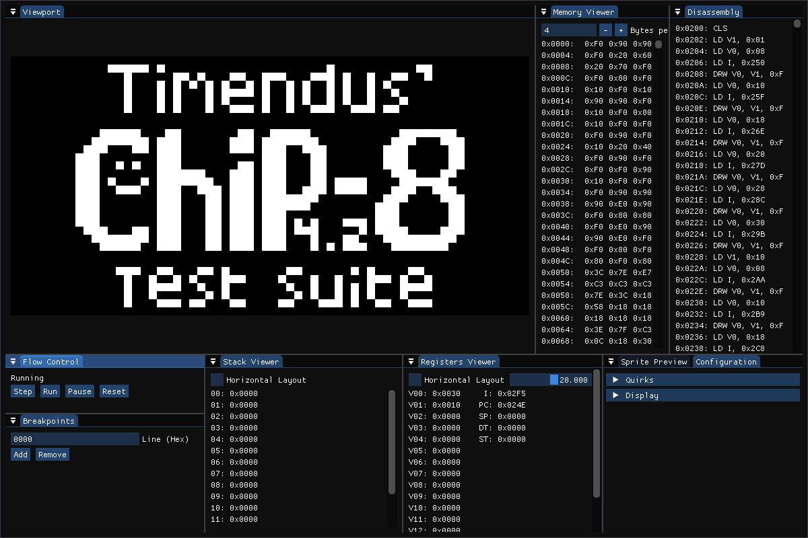

Output: The CHIP-8 logo is correctly displayed.

</details>

<details>
<summary><b>2. IBM Logo</b> - COSMAC Config</summary>

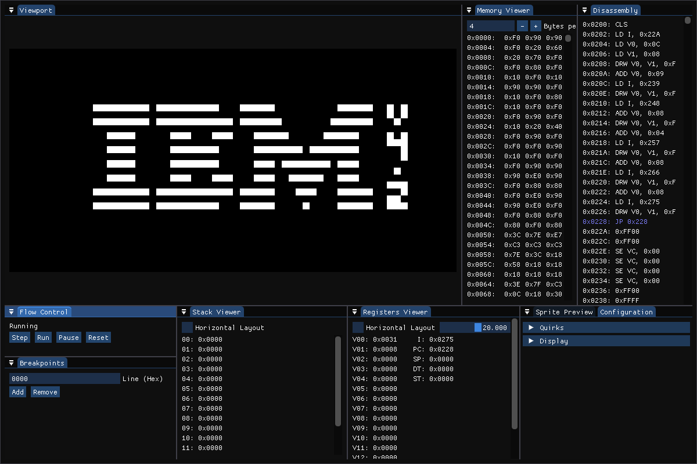

Output: The IBM logo is correctly displayed.

</details>

<details>
<summary><b>3. Corax+ Opcode Test</b> - COSMAC Config</summary>

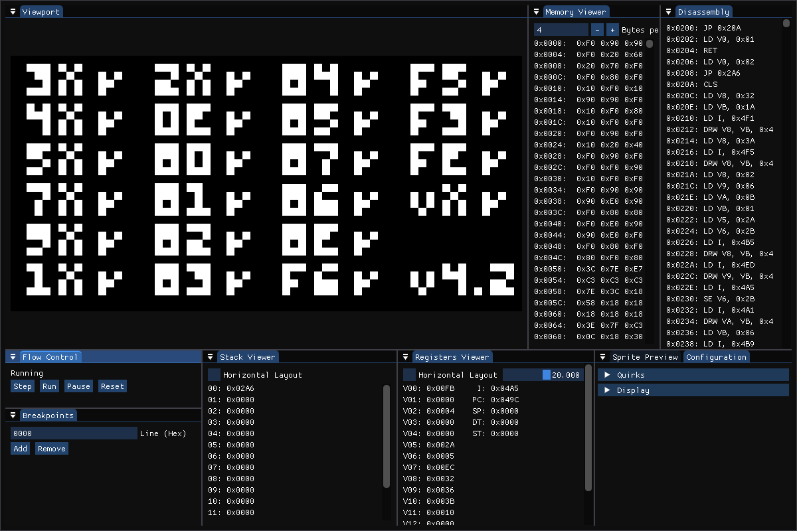

Output: All tested opcodes work correctly.

</details>

<details>
<summary><b>4. Flags Test</b> - COSMAC Config</summary>

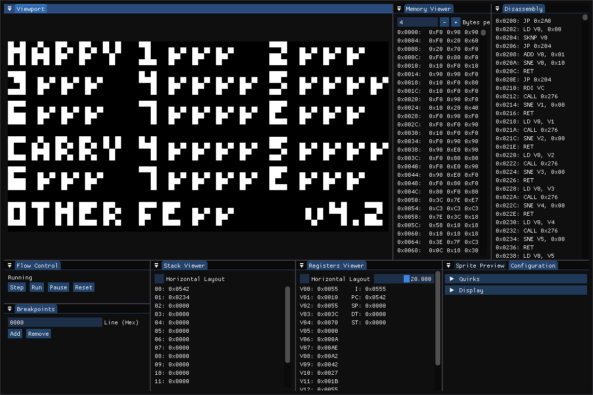

Output: All arithmetic and logical operations work correctly and set correct flags.

</details>

<details>
<summary><b>5. Quirks Test for CHIP-8</b> - COSMAC Config</summary>

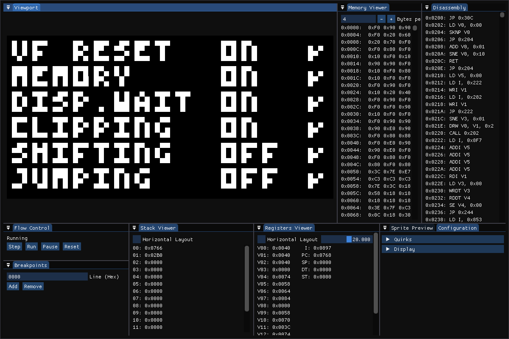

Output: All COSMAC quirks work and are set correctly.

</details>

<details>
<summary><b>5. Quirks Test for SCHIP Legacy</b> - SCHIP 1.0 Config</summary>

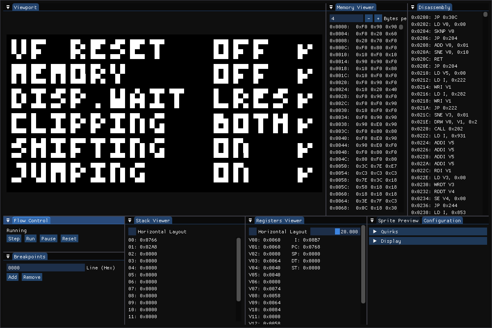

Output: All legacy SCHIP quirks work and are set correctly.

</details>

<details>
<summary><b>5. Quirks Test for SCHIP Modern</b> - SCHIP-MODERN Config</summary>

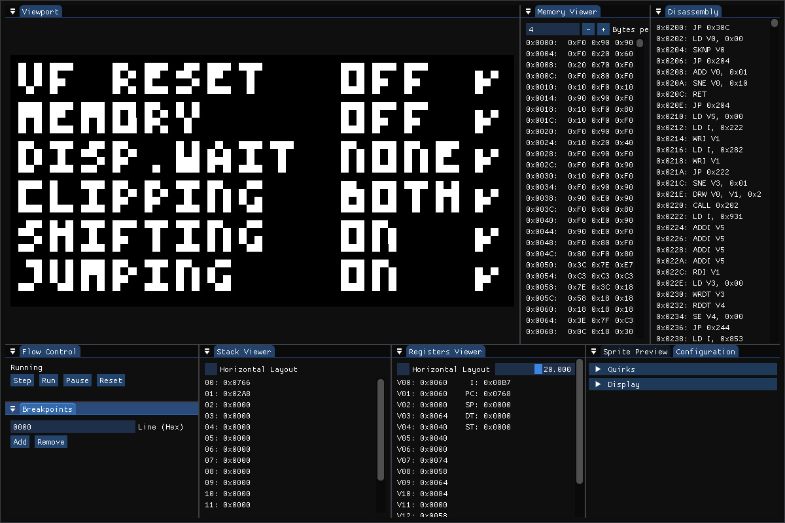

Output: All modern SCHIP quirks work and are set correctly.

</details>

<details>
<summary><b>6. Keypad Test</b> - COSMAC Config</summary>

### DOWN

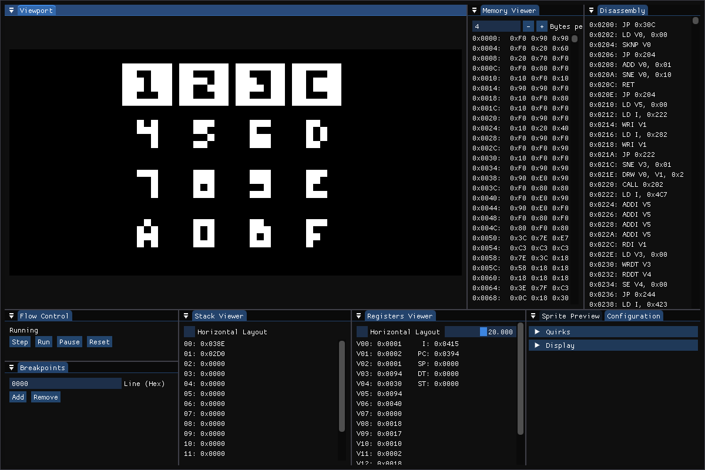

Input: Pressed top row of keys.

Output: Key down is correctly detected.

### UP

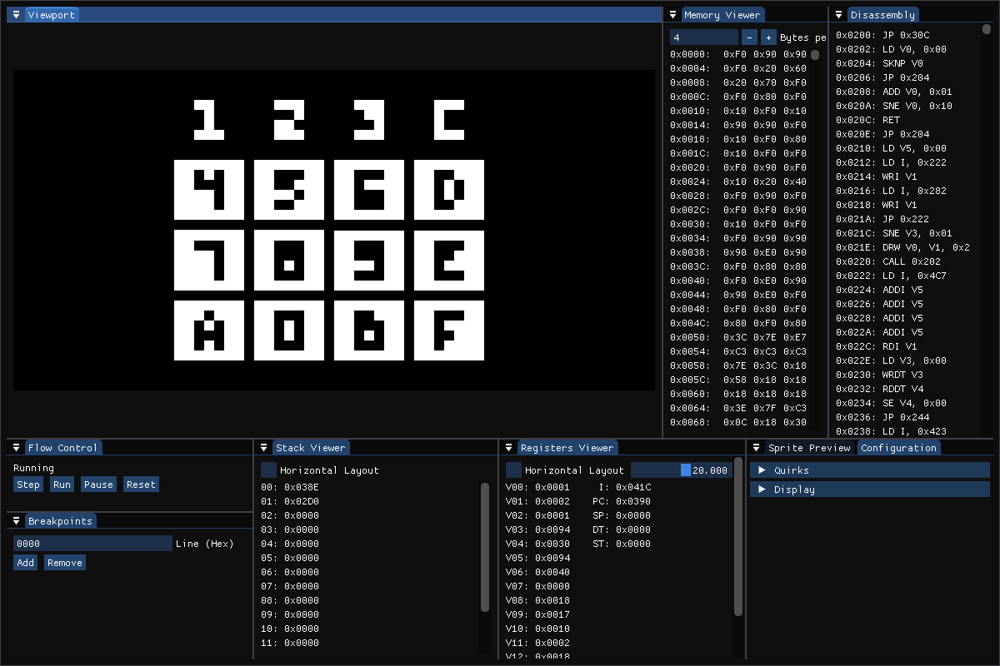

Input: Pressed top row of keys.

Output: Key up is correctly detected.

### GETKEY

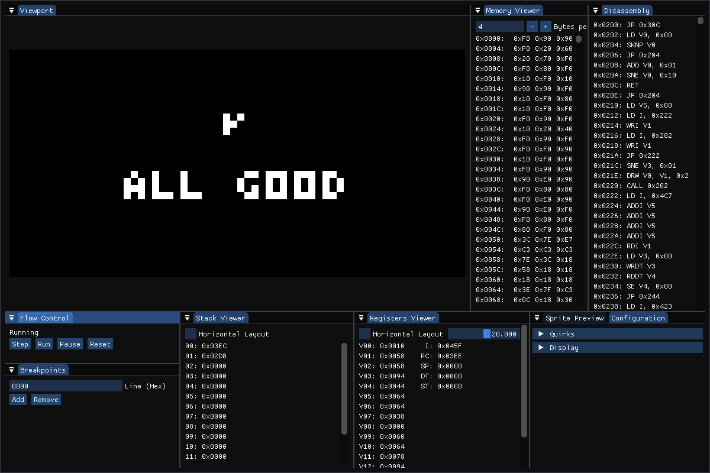

Input: Pressed any key.

Output: Get key is correctly detected.

</details>

<details>
<summary><b>7. Beep Test</b> - COSMAC Config</summary>

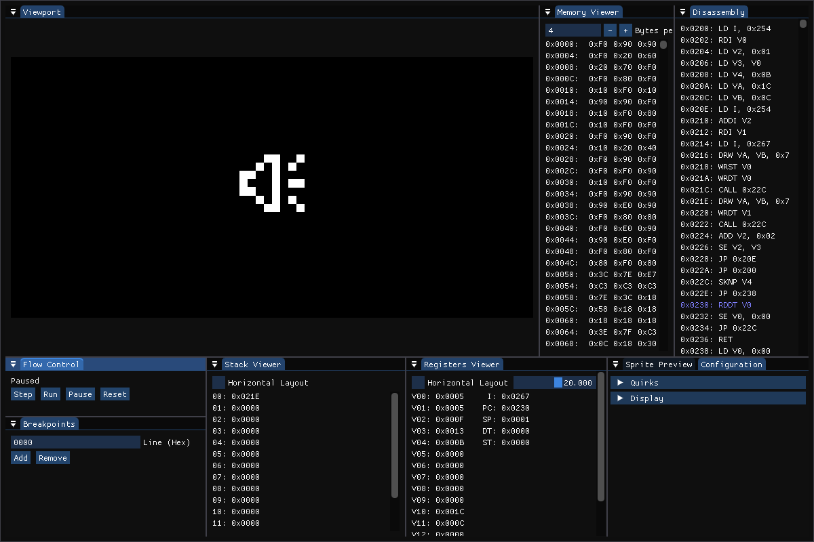

Output: A sound is played when an icon appears.

</details>

<details>
<summary><b>8. Scrolling Test for SCHIP Legacy</b> - SCHIP 1.0 Config</summary>

### Lores

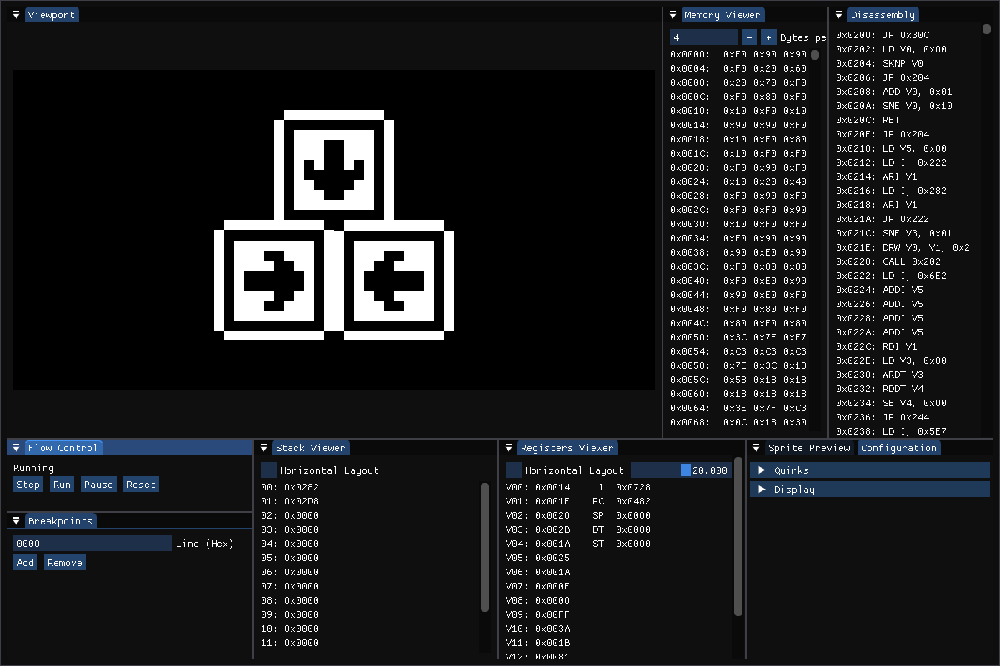

Output: Arrows are displayed correctly.

### Hires

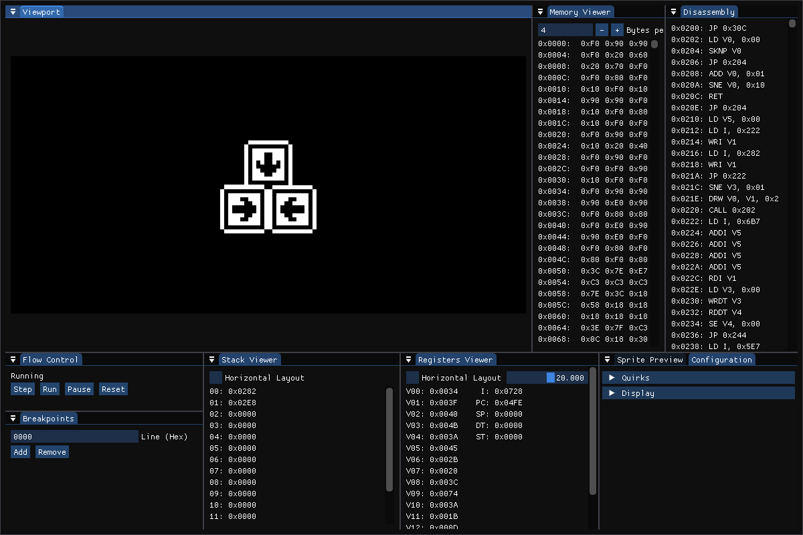

Output: Arrows are displayed correctly.

</details>

<details>
<summary><b>8. Scrolling Test for SCHIP Modern</b> - SCHIP-MODERN Config</summary>

### Lores

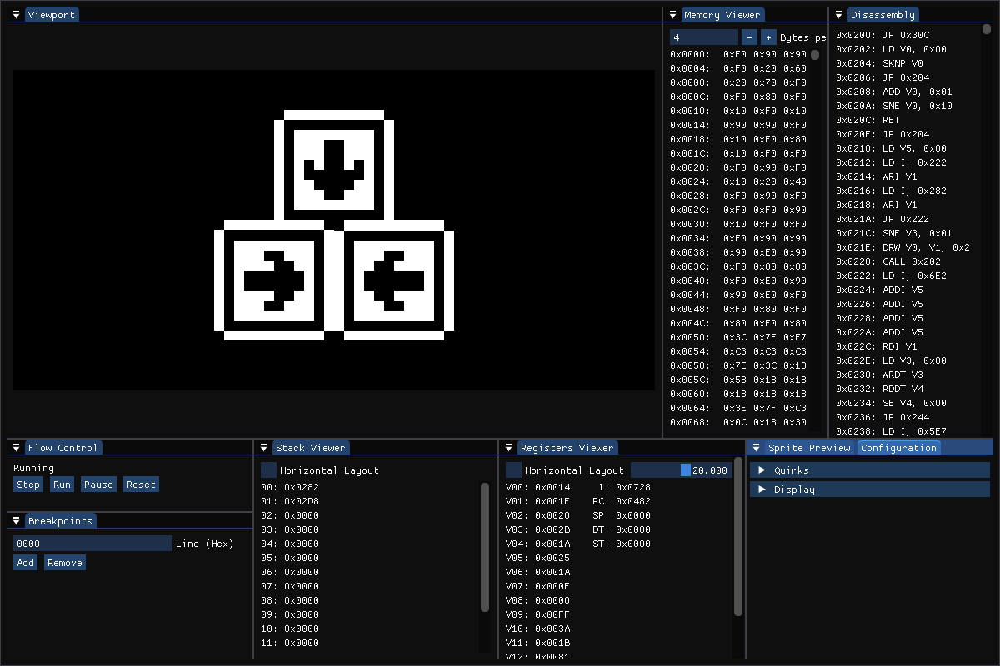

Output: Arrows are displayed correctly.

### Hires

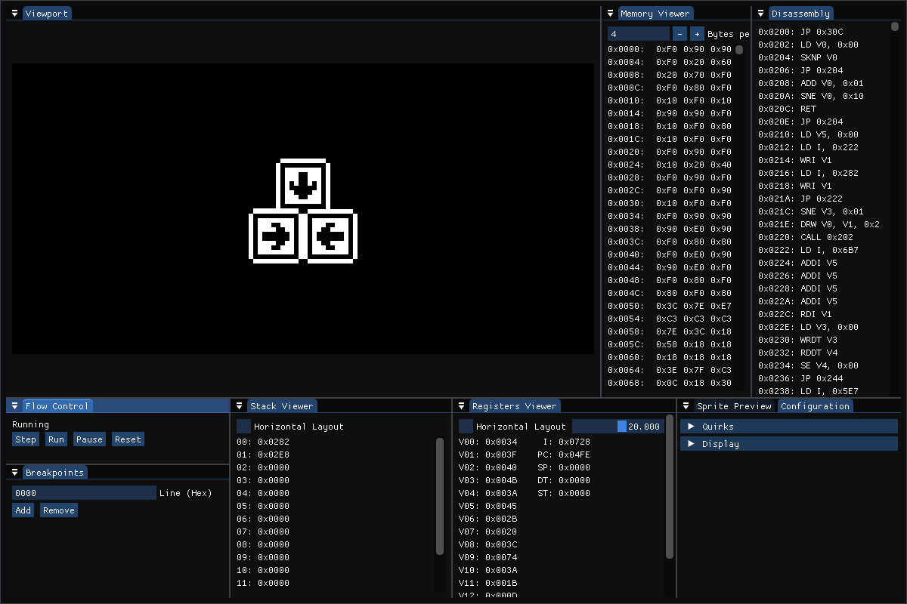

Output: Arrows are displayed correctly.

</details>

## CI

There is currently only one CI pipeline. The pipeline has 5 jobs:

- `Build` - Uses a build matrix to build the toolchain for multiple operating systems.
- `Build for WebAssembly` - Builds the emulator for WebAssembly using `emscripten`.
- `Run Clang-Tidy` - Runs clang-tidy static analysis.
- `Run Valgrind` - Runs Valgrind on the tests executable.
- `Run Tests` - Uses a build matrix to run tests on multiple operating systems.

`Build` and `Build for WebAssembly` are the first jobs to run. They run in parallel and upload their artifacts.

`Run Clang-Tidy`, `Run Valgrind` and `Run Tests` all run in parallel. They download the artifacts uploaded by previous jobs and use them.

`Run Valgrind` runs only on the tests executable, because I decided automating running an interactive program would be a rabbit-hole by itself and out of scope of this project.

Clang-tidy is run with the following checks:

```
clang-diagnostic-*,
clang-analyzer-*,
bugprone-*,
cppcoreguidelines-*,
performance-*,
```

I also decided to exclude a few checks due to the nature of the project - magic numbers, pointer arithmetic, and reinterpret cast are all things which would otherwise be enabled, but an emulator heavily relies on them.


# Sources

While working on this project I spent a lot of time looking for, and looking at CHIP-8 documentation. In this section I wanted to highlight some of the better sources for information, tests, and ROMs I used.

[Cowgod's Chip-8 Technical Reference](http://devernay.free.fr/hacks/chip8/C8TECH10.HTM#Fx1E)

[Guide to making a CHIP-8 emulator, Tobias V. I. Langhoff](https://tobiasvl.github.io/blog/write-a-chip-8-emulator)

[CHIP-8 Variant Opcode Table, Steffen "Gulrak" Schümann](https://chip8.gulrak.net)

[CHIP-8 Research Facility](https://chip-8.github.io/)

[chip8-test-suite, Tim "Timendus" Franssen](https://github.com/Timendus/chip8-test-suite)
